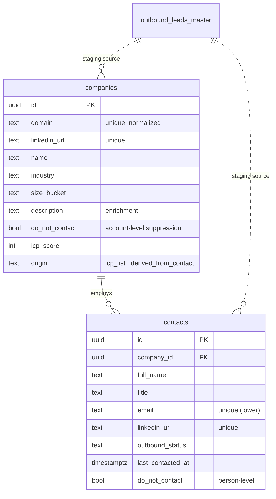

# Data architecture — outbound core

Foundation for the unprospect GTM OS. This folder defines the **normalized
outbound model** (`companies` 1 → N `contacts`) and the migration that builds it
from the existing staging table.

## TL;DR

- **`outbound_leads_master`** (8,636 rows) stays as the **raw / staging /
  ingestion layer**. Nothing here deletes or rewrites it.
- We add two clean tables on top: **`companies`** (account master) and
  **`contacts`** (person level), linked by a real FK.
- Migration is **additive, non-destructive, and idempotent** (safe to re-run).

## Why we changed the model

`outbound_leads_master` is a single-table polymorphic design (`record_type` ∈
`{contact, company}`). Profiling the live data showed it actually holds **two
unrelated datasets glued together**:

| | `contact` rows | `company` rows |
|---|---|---|
| Volume | 5,305 | 3,331 |
| Identity | email (`contact:email:…`, legacy `C#####`) | LinkedIn URL (`company:linkedin:…`, legacy `CO#####`) |
| Email present | 49% | — (`company_only`) |
| Firmographics | flattened inline (~83% have industry/size) | enriched (industry 97%, size 94%, description 100%) |
| Domain | clean | **18% NULL** (LinkedIn-only) |

The killer finding: **contact domains and company domains overlap 0%.** The
3,331 "companies" are an ICP/target-account list scraped from LinkedIn — they
are *not* the employers of the 5,305 contacts. So today a contact has **no real
link to a company entity**; company data is copied per row or missing.

Normalizing is what *creates* the `contact.company_id` link that doesn't exist
today — plus it removes per-row duplication and separates per-contact state
(`last_contacted_at`, `bounce_count`) from per-account state (`do_not_contact`).

## Target model



`contacts_enriched` is a view that joins contacts to their company
firmographics live — the replacement for the old "company_* columns copied onto
every contact".

## What the migration produces (validated against live data)

| Result | Count |
|---|---|
| companies total | **6,654** |
| — from ICP list (`origin = icp_list`) | 3,331 |
| — derived from contact domains | 3,323 |
| contacts total | **5,305** |
| — linked to a company | 5,212 |
| — without company (no domain → `company_id` NULL) | 93 |

Safety checks at design time: 0 duplicate emails, 0 duplicate LinkedIn URLs,
0 duplicate ICP domains → the `UNIQUE` indexes won't reject any rows.

## Files

| File | Purpose |
|---|---|
| `migrations/0001_core_companies_contacts.sql` | DDL: tables, indexes, FKs, `updated_at` triggers, `norm_domain()`, `contacts_enriched` view, RLS on |
| `migrations/0002_backfill_from_master.sql` | Idempotent backfill from `outbound_leads_master` |
| `migrations/0099_rollback.sql` | Drops only the new objects (start over) |
| `checks/verify.sql` | Post-migration verification (expected vs actual) |

## How to run

⚠️ Requires DDL access, which the `service_role` API key does **not** grant.
Use one of:

**A. Supabase SQL Editor (simplest):** paste `0001…`, then `0002…`, then
`checks/verify.sql`, in order.

**B. psql / Management API (lets the agent run + verify it):** provide the
Postgres connection string (Supabase → Project Settings → Database → Connection
string, "Session" pooler) or a Supabase Personal Access Token + project ref.
Then:

```bash
psql "$DATABASE_URL" -f db/migrations/0001_core_companies_contacts.sql
psql "$DATABASE_URL" -f db/migrations/0002_backfill_from_master.sql
psql "$DATABASE_URL" -f db/checks/verify.sql
```

## Roadmap (next phases)

- **Phase 2 — engagement layer:** `campaigns`, `sequence_steps`, `enrollments`,
  `touches` (one row per send: channel, step, status, sent/opened/replied/
  bounced). Replaces the flat `outbound_initial_body` / `follow_up_*` columns
  with real history. Wires to **Instantly** (email) and LinkedIn sending.
- **Phase 3 — enrichment loop:** **Parallel.ai** for company/contact enrichment,
  **Apify** for scraping; backfill the 3,331 ICP companies with contacts and the
  3,323 contact-derived companies with firmographics.
- **Skills** (campaign ideation, copywriting, contact lookup) read/write through
  this normalized model, not the staging table.
```
